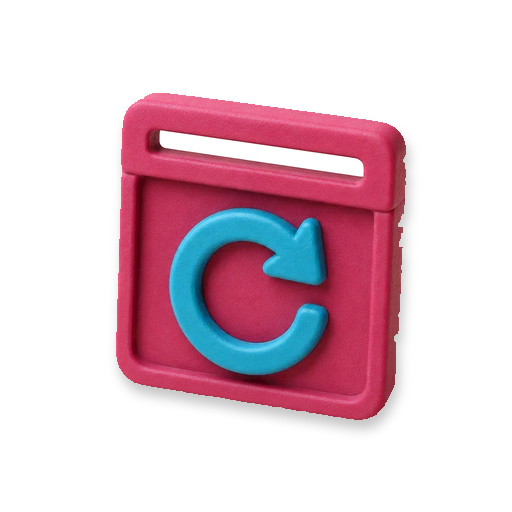

<p align="center">
  
</p>

<h1 align="center">Reel</h1>

<p align="center"><strong>See what a user's browser did before the bug — recorded into infrastructure you own.</strong></p>

Reel is browser session replay for Laravel applications. A small recorder in your application captures a
privacy-filtered copy of what happened on the page — not video, but the DOM changes, clicks, and scrolls that
produced it. Reel stores those recordings in your own [Laravel Cloud](https://cloud.laravel.com) account and
replays them next to the Laravel request that failed.

It replaces the one thing most teams actually use a hosted session replay service for: *show me what this user
did before the 500*. It is deliberately not an analytics suite. There are no heatmaps, no funnels, no native
mobile SDKs, and no console logs or network bodies in the recording.

Reel is open source and MIT licensed. Artisan Build does not meter your sessions or recordings and runs no
data plane for them; your Laravel Cloud bill is the only thing that grows.

> **Status: experimental.** Reel runs, but it has not finished the browser, privacy, performance, cost, and
> retention evidence it needs to be a supported product. Read the
> [known limitations](docs/limitations.md) before you record real users, and start with a consented pilot.

## The easy way: Scalpels

[Scalpels](https://scalpels.app/products/reel) is the control plane for Built for Cloud applications. Buy
Reel there and Scalpels forks this repository into your own GitHub organisation, provisions the Laravel Cloud
resources Reel needs, and deploys it for you.

The repository and the infrastructure are yours either way. The only difference is who spends the afternoon
doing the steps below.

## Run it yourself

### What you need

- **PHP 8.3 or newer.** CI runs the suite on 8.4 and 8.5.
- **Composer.**
- **A PostgreSQL server** you can create databases on. Several migrations use PostgreSQL-specific SQL, so
  MySQL and SQLite are not supported.
- **A Laravel Cloud account**, when you reach the deploy step.

You do *not* need Node, npm, or Vite. Reel has no frontend build step — the compiled CSS is committed under
`public/build/assets/`.

### 1. Get the code and install dependencies

```bash
git clone https://github.com/artisan-build/reel.git
cd reel
composer install
```

### 2. Create your environment file

```bash
cp .env.example .env
php artisan key:generate
```

`key:generate` writes an `APP_KEY` into `.env`. Laravel uses it to encrypt cookies and stored secrets, so
every install needs its own.

### 3. Create two databases

Reel uses one database for development and a second one for the test suite:

```bash
psql -h 127.0.0.1 -U <your-postgres-role> -d postgres -c 'CREATE DATABASE reel;'
psql -h 127.0.0.1 -U <your-postgres-role> -d postgres -c 'CREATE DATABASE reel_app_test;'
```

Then set `DB_USERNAME` and `DB_PASSWORD` in `.env` to that role.

The test database is separate on purpose: the suite resets it between tests. Its name and credentials are
pinned in [`phpunit.xml`](phpunit.xml) rather than read from `.env` — `reel_app_test` on `127.0.0.1:5432`, as
the role `root` with an empty password. If your PostgreSQL server does not have that role, change the values
in `phpunit.xml` to ones it does have.

### 4. Run the migrations

```bash
php artisan migrate
```

That runs 50 migrations and leaves 50 tables in `reel`: Reel's own applications, recording sessions, chunks,
and retention tables, plus the users, credentials, and authority tables owned by the Built for Cloud package.

### 5. Create the first administrator

```bash
php artisan create-admin --local
```

The command prompts for an email address, a name, and a password, then creates the installation's single
**Owner**. Once an Owner exists it refuses to run again; `--force` then creates an Admin instead of a second
Owner.

> **`--local` is not optional here.** `create-admin` comes from the Built for Cloud package, and without
> `--local` it asks whether to create the user on this machine *or in one of your Laravel Cloud environments*,
> and can create a real administrator in production. The same is true of every `bfc:*` command. Reel's own
> `reel:*` commands always run where you run them.

### 6. Run the tests

```bash
composer test
```

This clears the config cache, checks formatting with Pint, runs the application suite against
`reel_app_test`, then runs the client package's own suite. A green run means your PHP version, PostgreSQL
connection, and install are all sound.

The recorder's security tests execute real JavaScript through JavaScriptCore. macOS ships the `jsc` binary
inside the system JavaScriptCore framework and the tests find it there automatically. On Linux, install it
first (`libjavascriptcoregtk-4.1-bin`), or point `JSC_BINARY` at your own build — without it those tests
fail rather than skip.

### 7. Start the application

```bash
composer dev
```

That serves Reel at <http://localhost:8000>, or the next free port if 8000 is taken — read the URL it
prints. You should see a Reel landing page.

Sign in at `/bfc/login` with the Owner you just created. Built for Cloud owns login, password reset,
invitations, and session management, and they all live under `/bfc`. Reel itself defines no login screen and
no user model. After signing in, Reel's own screens are at `/dashboard`, `/applications`, and `/sessions`.

### 8. Deploy to Laravel Cloud

Reel is built to run on Laravel Cloud, and [`built-for-cloud.json`](built-for-cloud.json) declares exactly
what it needs: one compute application, a PostgreSQL database, a **private** Laravel Object Storage bucket, a
managed queue, and the scheduler. It needs no paid cache.

> ### ⛔ Never set environment variables for resources Cloud provisions
>
> When you attach a database, cache, queue, or bucket, Laravel Cloud writes that resource's configuration
> into its own managed environment file and injects it at runtime. That includes the connection selectors,
> not just the credentials: `DB_CONNECTION`, `CACHE_STORE`, `QUEUE_CONNECTION`, `FILESYSTEM_DISK`, and every
> `DB_*`, `AWS_*`, and `SQS_*` value.
>
> **If you set any of those yourself, your value shadows the injected one and the resource breaks.** Set only
> genuinely app-specific variables in Cloud: `APP_ENV`, `APP_DEBUG`, `APP_NAME`, `APP_URL`. Let Cloud manage
> `APP_KEY`.
>
> `.env.example` in this repository is local development configuration, not deployment configuration. Never
> copy it into a Cloud environment, and never run `composer setup` as part of a deploy.

The steps:

1. **Fork this repository** into your own GitHub organisation.
2. **Run `cloud ship`** from your clone. It is interactive, and it is the reliable way to create the
   application and environment, connect the repository, and create *and attach* the PostgreSQL database in
   one pass. Enable the scheduler when it offers — Reel needs it.
3. **Run `cloud repo:config`** afterwards. `ship` does not write `.cloud/config.json` itself, and without it
   later CLI commands do not know which application they are talking to.
4. **Create a private object storage bucket** and attach it to the environment. Creation is scriptable;
   attaching is a dashboard step (Environment → Storage), because the CLI has no bucket attach flag. Use
   `--visibility private` — Reel serves replay data through its own authenticated player, never from a public
   bucket URL.
5. **Create a managed queue** and make it the default (`cloud managed-queue:create`, then
   `managed-queue:set-default`). Use a managed queue, not a long-running worker instance.
6. **Set only the app-specific variables** listed in the box above.
7. **Deploy.** The build runs `composer install --no-dev --optimize-autoloader` and `php artisan optimize`.
   After the deploy, `php artisan migrate --force` runs, followed by `php artisan reel:smoke`.
8. **Read the smoke output.** `reel:smoke` checks that the database, object storage, queue, and scheduler are
   all really there. It refuses to report ready unless the resolved disk is S3-backed and the queue is not
   running inline, so a failing smoke means a resource is missing or shadowed — not a cosmetic warning.
9. **Create the first Owner in the deployed environment**: `php artisan create-admin --environment=<env>`.
   Your machine collects the password and generates its hash; only the hash travels to Cloud. Do not print or
   store either one.

Attaching the database and attaching the bucket are the two steps the Laravel Cloud CLI cannot do headlessly
today; do them in the dashboard and confirm there rather than trusting a CLI read.

Full deployment, recovery, upgrade, rotation, backup, and uninstall procedures are in
[`docs/deployment.md`](docs/deployment.md).

### 9. Connect a Laravel application

1. Sign in to your Reel deployment and open **Applications → Create application**. Give it a name, one
   allowed origin per line (`https://app.example.com` — no paths or query strings), and a sampling percent.
2. Copy the **enrollment code** shown on the next screen. An enrollment code is a one-time secret that proves
   to Reel that the application registering a signing key really is the one you just created. It expires in
   15 minutes, Reel stores only a hash of it, and it is never shown again.
3. In the application you want to record, install the Reel client and run its installer:

   ```bash
   composer require artisan-build/reel-client
   php artisan reel:install
   ```

   > `artisan-build/reel-client` is **not published on Packagist yet**. Until it is, add this repository's
   > `packages/reel-client` directory as a Composer path repository, or point Composer at a VCS repository
   > you control.

   The installer generates an RSA private key inside your application, sends only the **public** key to
   Reel's enrollment endpoint, and writes `REEL_URL`, `REEL_APPLICATION_ID`, `REEL_PRIVATE_KEY`, and
   `REEL_CONTEXT_EXPORT` to that application's `.env`. The private key never leaves your application — Reel
   uses the public key to verify that each upload was signed by you.

4. **Hide sensitive routes before you record anything.** The exclusion is absolute for that response:

   ```php
   Route::get('/billing/payment-method', PaymentMethodController::class)->hiddenFromReel();

   Route::hiddenFromReel()->group(function (): void {
       require __DIR__.'/auth.php';
   });
   ```

   Review authentication, password recovery, card entry, health data, and privileged admin routes. Sensitive
   content inside an otherwise recordable page still needs `data-reel-mask`, `data-reel-block`, or configured
   selectors.

5. **Add the recorder to your layout.** It loads the assets but records nothing on its own:

   ```blade
   <x-reel::recorder />
   ```

6. **Start recording only after your own consent decision:**

   ```js
   await Reel.start({ consent: true });
   ```

   Pass `refuseOnGpc: true` to make a browser's Global Privacy Control signal an automatic refusal.

Sessions then appear under **Sessions** in Reel, and `Reel::sessionsUrlFor($model)` builds a filtered Reel
link from an application-scoped primary key. Those links are filters, not access credentials — anyone opening
one still has to sign in to Reel.

## Configuration

Reel reads very little from the environment. Most of its behaviour is set in config files you edit and commit.

### Environment variables (the Reel server)

| Variable | Default | What it does |
| --- | --- | --- |
| `APP_KEY` | *(none)* | Laravel's encryption key. Required. |
| `APP_URL` | `http://localhost` | The base URL clients enroll against. |
| `DB_CONNECTION` | `pgsql` | Must stay PostgreSQL. **Do not set in Laravel Cloud.** |
| `DB_HOST`, `DB_PORT`, `DB_DATABASE`, `DB_USERNAME`, `DB_PASSWORD` | local values | Development database. **Do not set in Laravel Cloud.** |
| `SESSION_DRIVER`, `CACHE_STORE`, `QUEUE_CONNECTION`, `FILESYSTEM_DISK` | `database`/`database`/`database`/`local` | Local development drivers. **Do not set in Laravel Cloud.** |
| `AWS_*` | empty | Object storage. **Do not set in Laravel Cloud.** |
| `BUILT_FOR_CLOUD_CREDENTIAL_GUARD` | `bfc` | The auth guard used to resolve presented credentials. Leave it alone unless you know why you are changing it. |

### Config files

| File | Key settings |
| --- | --- |
| [`config/reel_ingest.php`](config/reel_ingest.php) | Upload limits and session timing: `maximum_request_bytes` (384 KB), `maximum_decompressed_chunk_bytes` (2 MB), `maximum_grant_lifetime_seconds` (31 minutes), `abandoned_after_seconds` (15 minutes), `late_arrival_window_seconds` (2 minutes), `object_prefix` (`reel/chunks`). |
| [`config/reel_retention.php`](config/reel_retention.php) | `ordinary_days` (30), `unprotect_cooling_hours` (72), `orphan_safety_delay_hours` (24). |
| [`config/replay.php`](config/replay.php) | Player ceilings: `maximum_compressed_object_bytes` (64 MB), `maximum_decompressed_bytes` (128 MB). |
| [`config/built-for-cloud.php`](config/built-for-cloud.php) | The catalog manifest and which Built for Cloud screens are enabled. `credentials.app_purposes` maps Reel's `reel.application.signing` operation to the package's `signing` **purpose** — the fixed label that decides what a credential is allowed to be used for. |

### Environment variables (a monitored application)

`php artisan reel:install` writes these into the application you are recording. `REEL_PRIVATE_KEY` is a
secret: treat it like a database password.

| Variable | What it does |
| --- | --- |
| `REEL_URL` | Base URL of your Reel deployment. |
| `REEL_APPLICATION_ID` | The public id of the Reel application this app enrolled as. |
| `REEL_PRIVATE_KEY` | The signing key that authorises uploads. Never leaves the application. |
| `REEL_CONTEXT_EXPORT` | `off`, `session_id`, or `session_id_and_url`. Controls whether the session id rides along in Laravel Context to your Nightwatch transport. |
| `REEL_RELEASE_ID` | Optional release marker recorded with each session. |
| `REEL_HOST_MODE` | Optional override. The client turns itself on automatically when `REEL_URL` and `REEL_PRIVATE_KEY` are both set. |

## Scheduled work

Reel does its housekeeping on the scheduler, so Laravel Cloud's scheduler must be enabled. All five commands
run locally too, which is the easiest way to see what they do:

| Command | Runs | What it does |
| --- | --- | --- |
| `reel:finalize-sessions` | every minute | Closes abandoned sessions and queues compaction. |
| `reel:retain-sessions` | hourly | Deletes unprotected sessions past their retention deadline. |
| `reel:retry-deletions` | hourly | Reports incomplete deletions; `--apply` retries them. |
| `reel:resume-erasures` | every 5 minutes | Reports running user-erasure batches; `--apply` resumes them. |
| `reel:sweep-orphans` | daily | Removes stored objects with no database row. |

`reel:reconcile-storage` is a manual diagnostic. It is a dry run unless you pass an explicit mutation flag.

## Troubleshooting

**`reel:smoke` fails locally with "The configured filesystem driver [local] is not S3-backed".**
That is correct behaviour. `reel:smoke` is a *deployment* check and only passes against real S3-backed object
storage and a real queue. Do not expect it to go green on your laptop.

**`create-admin` asks me where to create the user, and offers Laravel Cloud environments.**
Add `--local`. See step 5.

**`composer test` cannot connect to the database.**
The suite ignores `.env` and uses the values pinned in `phpunit.xml` — database `reel_app_test`, role `root`,
empty password, `127.0.0.1:5432`. Create that database and role, or edit `phpunit.xml`.

**`composer require artisan-build/reel-client` fails with "package not found".**
The client is not on Packagist yet. Add `packages/reel-client` from this repository as a Composer path
repository for now.

**Sessions never appear in Reel.**
Check, in order: the recording application's origin exactly matches one of the application's allowed origins
(scheme and host, no trailing path); your application calls `Reel.start()` after its consent decision; the
route is not marked `hiddenFromReel()`; and ingest is still enabled for that application in its Reel
settings. Uploads are rejected with a short reason such as `origin_mismatch` or `application_disabled`.

**A replay looks wrong — images and fonts are missing.**
Playback is deliberately network-free. External images, media, fonts, stylesheets, and iframe content are
replaced by placeholders so that replaying a session never calls out to anything. See
[known limitations](docs/limitations.md).

## Development

`composer ready` is the single hard gate, and it must be green on a clean, committed tree before a pull
request is reviewed. It runs the IDE helpers, Rector, Pint, PHPStan (Larastan, level 6), the Pest suites, and
a Composer security audit.

```bash
composer ready
```

Individual pieces: `composer lint` (Pint), `composer lint:check` (Pint, check only), `composer stan`
(PHPStan), `composer test` (Pest), `composer report` (everything, non-blocking, section by section).

CI runs the same tools on every push and pull request to `main`: `.github/workflows/tests.yml` runs PHPStan,
Pest, and `composer audit` on PHP 8.4 and 8.5 against PostgreSQL 16, and `.github/workflows/lint.yml` runs
Pint in check mode.

Feature work follows the coordinated build described in [`.solo/workflow.md`](.solo/workflow.md).

## Where things are

| | |
| --- | --- |
| [`docs/product/reel-prd.md`](docs/product/reel-prd.md) | The full product definition, scope, and decisions. |
| [`docs/deployment.md`](docs/deployment.md) | Deployment, authority, rotation, backup, and uninstall. |
| [`docs/limitations.md`](docs/limitations.md) | What Reel does not do. Read before recording real users. |
| [`docs/retention.md`](docs/retention.md) | Retention, protection, and deletion behaviour. |
| [`docs/runbooks/`](docs/runbooks) | What to do when compaction stalls, chunks are rejected, storage grows, retention fails, or a restore leaves uncertainty. |
| [`packages/reel-client`](packages/reel-client) | The Laravel client installed into monitored applications. |

## Stack

PHP 8.3+ · [Laravel](https://laravel.com) 13 · Livewire 4 + Flux · PostgreSQL ·
[`artisan-build/built-for-cloud`](https://github.com/artisan-build/built-for-cloud) v0.16 for users, roles,
and credentials · nodeless assets via `laravel/chisel`. Scaffolded from the
[`artisan-build/laravel-nodeless`](https://github.com/artisan-build/laravel-nodeless) starter kit.

## License

Reel is open-source software licensed under the [MIT license](LICENSE).
